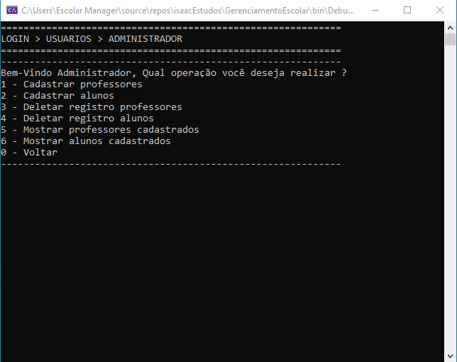

# Escolar Manager

<!---Esses são exemplos. Veja https://shields.io para outras pessoas ou para personalizar este conjunto de escudos. Você pode querer incluir dependências, status do projeto e informações de licença aqui--->

> Console Project feito em c# para simular uma gestão de sistema escolar.

## 📫 Contribuindo para Escolar Manager
<!---Se o seu README for longo ou se você tiver algum processo ou etapas específicas que deseja que os contribuidores sigam, considere a criação de um arquivo CONTRIBUTING.md separado--->
Para contribuir com Escolar Manager, siga estas etapas:

1. Bifurque este repositório.
2. Crie um branch: `git checkout -b <nome_branch>`.
3. Faça suas alterações e confirme-as: `git commit -m '<mensagem_commit>'`
4. Envie para o branch original: `git push origin <nome_do_projeto> / <local>`
5. Crie a solicitação de pull.

Como alternativa, consulte a documentação do GitHub em [como criar uma solicitação pull](https://help.github.com/en/github/collaborating-with-issues-and-pull-requests/creating-a-pull-request).

## 🤝 Colaboradores

Agradecemos às seguintes pessoas que Ajudaram neste projeto:

<table>
  <tr>
    <td align="center">
      <a href="https://github.com/Isaac-Brasil-EM">
         
        
          <b>Isaac Brasil</b>
        
      </a>
    </td>
     <td align="center">
      <a href="https://github.com/Diego-Aleixo-EM">
         
        
          <b>Diego Aleixo</b>
        
      </a>
    </td>
     <td align="center">
      <a href="https://github.com/Joao-Rezende-EM">
         
        
          <b>João Vitor</b>
        
      </a>
    </td>
    <td align="center">
      <a href="https://github.com/armandoj-oliveira">
         
        
          <b>Armando José</b>
        
      </a>
    </td>
    <td align="center">
      <a href="https://github.com/Manoella-Matias-EM">
         
        
          <b>Manoella Matias</b>
        
      </a>
    </td>
  </tr>
</table>

## 😄 Seja um dos contribuidores 

Quer fazer parte desse projeto? Clique [AQUI](https://github.com/Isaac-Brasil-EM/Escolar-manager#-contribuindo-para-escolar-manager) e leia como contribuir.

[⬆ Voltar ao topo](#escolar-manager) 
